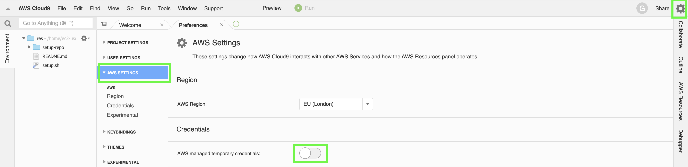

# Lab - Intro to Kubernetes

The purpose of this lab is to deploy a "hello world" application to
Kubernetes. In doing so you will learn several key Kubernetes concepts.

## Setup and Prerequisites

### Software

You will need the following software installed and in your `PATH` on the
command line where appropriate in order to complete the exercises in
this document.

- `aws-iam-authenticator`
- `docker`
- `git`
- `kubectl`
- `python`

Should you get any missing command errors whilst following this
guide, please first double check the command you have entered and then
speak to one of the instructors.

### Access

You will also need access to the following in order to complete the
exercises:

- GitHub access. You should have signed up for an account on
  <https://github.com/>.
- DockerHub access. You should have signed up for a DockerHub account
  here <https://hub.docker.com>.

If you do not have either or both of these, please sign up for them now
using the links provided.

You will also need:

- Kubernetes cluster access. This is provided by Armakuni on your
  workstation, you should not need to configure this yourself. Checks
  to ensure access will be performed during a later step.

### Working directory and code

#### Create a working directory

If it does not already exist, please create a directory on the machine
with the following command:

```cmd
mkdir $HOMEPATH/Code
mkdir $HOMEPATH/Code/day-2
```

Next, move into the directory:

```cmd
cd $HOMEPATH/Code/day-2
```

#### Checkout the code

You will now need to fork the `lab-intro-to-kubernetes` exercise from
Armakuni's GitHub account. To do this, log into your GitHub account in
the web UI and navigate to:

    https://github.com/software-engineering-practices/lab-intro-to-kubernetes

In the top right hand corner, you will find a button that says `Fork`.
Click this and it will automatically fork the repository into your
account. If you have problems doing so, please follow this guide:

    https://help.github.com/articles/fork-a-repo/#platform-windows

You should now be able to access the repo in your own account. Follow
the link below, replacing `GITHUB_ID` with your GitHub ID:

    https://github.com/GITHUB_ID/lab-intro-to-kubernetes

This should take you to your fork. Next you should checkout this fork
into your working directory by running the following command, replacing
`GITHUB_ID` with your GitHub ID:

```cmd
cd $HOMEPATH/Code/day-2
git clone git@github.com:GITHUB_ID/lab-intro-to-kubernetes.git
```

This should have cloned the code into your working directory. You can
now browse the code with your editor.

## Exercise 1 - Docker

In this section, you are going to:

- Login to DockerHub on the command line and web UI
- Create a repository in DockerHub
- Build an image from the "hello world" code and a `Dockerfile`
- Test the image on a local `docker` daemon
- Push the image to DockerHub

Firstly ensure that your local `docker` installation is working
correctly:

```bash
docker ps
```

This should return a list (or an empty list) of Docker containers. If
you receive any errors, you will need to debug your installation.

Login to DockerHub on the command line with the following command:

```bash
docker login
```

You will be prompted to enter your username and password.

You will need to login if you haven't already.
You should see a large button that says `Create Repository +` on the
dashboard after logging in, click this button.

Next, give the repository its name and a description (the description is optional).
Finally, click `Create`.

Back in the terminal, `cd` into the root of the
`lab-intro-to-kubernetes` repository and build an image from the
`Dockerfile`:

> Note: in each of the following commands, replace `DOCKER_ID` with your
> DockerHub username.

```bash
docker build -f Dockerfile -t DOCKER_ID/lab-intro-to-kubernetes:0.0.1 .
```

Then you can test the application by running:

```bash
docker run -d -p 8080:5000 --name intro-to-kubernetes DOCKER_ID/lab-intro-to-kubernetes:0.0.1
```

This should make the application available on:

    http://127.0.0.1:8080

Once you have finished viewing it, delete it with

```bash
docker stop intro-to-kubernetes
docker rm intro-to-kubernetes
```

Push the application to DockerHub with the following command:

```bash
docker push DOCKER_ID/lab-intro-to-kubernetes:0.0.1
```

> Note: this can take some time depending on network speeds.

Your image should now be available in DockerHub. With your image now in
a public repository, you can now launch your application in Kubernetes.

### Secrets - very important, please read

Secrets such as credentials and other personal information should
**NEVER** be built into Docker images. It's really important to think
carefully about what you add to a Docker image as it is very easy to
carelessly add everything accidentally and push secrets to a public
repository.

For example, you might have a credentials file that you ignore in
`.gitignore`, but forget to ignore in `.dockerignore`. There can also be
sensitive information stored in your `.git` directory which should also
be excluded.

## Exercise 2 - Kubernetes

Note:

If you are using Cloud9 IDE, disable the AWS Temporary credentials by first following below path in your Cloud9 IDE:

Setting Button (Top Right) > AWS SETTINGS > Disable : AWS managed temporary credentials



Open a new Terminal and set AWS Credential by running below command (If you do not have the credentials ask the instructor):

```
aws configure
```

Verify the user identity by running below command:

```
aws sts get-caller-identity
```

Now let us set the kube config to point our cluster.

Ask for the cluster name and AWS Region where cluster is deployed,
Ideally this should be "prod-ak-k8s-cluster" and "eu-west-2".

```
aws eks --region [AWS-REGION] update-kubeconfig --name [CLUSTER-NAME]
```

Check to ensure that your `kubectl` has the correct configuration:

```bash
kubectl config view
```

You should see something similar to the following, with the exception of
the two `REDACTED` fields which should contain data for `server` and
`certificate-authority-data`.

```yaml
---
apiVersion: v1
clusters:
  - cluster:
      server: REDACTED
      certificate-authority-data: REDACTED
    name: kubernetes
contexts:
  - context:
      cluster: kubernetes
      user: aws
    name: aws
current-context: aws
kind: Config
preferences: {}
users:
  - name: aws
    user:
      exec:
        apiVersion: client.authentication.k8s.io/v1alpha1
        command: aws-iam-authenticator
        args:
          - "token"
          - "-i"
          - "prod-ak-k8s-cluster"
```

If you see something like this:

```yaml
---
apiVersion: v1
clusters: []
contexts: []
current-context: ""
kind: Config
preferences: {}
users: []
```

then your `kubectl` has not been configured correctly. Please speak to
one of the instructors to fix this issue.

Next check that the `kubectl` config is valid:

```bash
kubectl get namespaces
```

You should get an output similar to the one below:

    NAME          STATUS   AGE
    default       Active   2h
    kube-public   Active   2h
    kube-system   Active   2h

If you receive an error, try the steps in the troubleshooting section to
see if there is a common cause. You will likely need help from an
instructor to resolve.

#### Update the configuration file

In the `lab-intro-to-kubernetes` repository, you will find the following
file:

    lab-intro-to-kubernetes/kubernetes/deployment.yml

It should look like the following:

```yaml
---
apiVersion: apps/v1
kind: Deployment
metadata:
  name: frontend
  labels:
    app: kubernetes-intro
spec:
  selector:
    matchLabels:
      app: kubernetes-intro
      tier: frontend
  replicas: 1
  template:
    metadata:
      labels:
        app: kubernetes-intro
        tier: frontend
    spec:
      containers:
        - name: kubernetes-intro-web
          image: DOCKER_ID/lab-intro-to-kubernetes:latest
          resources:
            requests:
              cpu: 100m
              memory: 100Mi
          ports:
            - containerPort: 5000
          env:
            - name: RECIPIENT
              value: "world"
```

Edit this file and replace the `DOCKER_ID` with your DockerHub username.
Save the file.

#### Setting your namespace

You you have been created a unique namespace to in Kubernetes to work
inside. You can see it by running:

```bash
kubectl get namespaces
```

It will match the GitHub ID you gave us.

This should return something like the following:

    NAME            STATUS   AGE
    NAMESPACE  Active   50m
    default         Active   5h
    YOUR_GITHUB_ID  Active   5h
    kube-public     Active   5h
    kube-system     Active   5h

Creating and using a namespace is important to avoid naming collisions
with other users. By using a namespace you can deploy applications with
the same name as other people and not have to worry that they will
collide. It's also a way of preventing users of kubernetes from being
able to interfere with one another accidentally (or intentionally).

#### Launch the application

> Note: from now on, replace `NAMESPACE` in all of the following
> commands with the name of your namespace.

Next, to launch the application run the following from within the
`lab-intro-to-kubernetes` repository:

```bash
kubectl apply -n NAMESPACE -f kubernetes/deployment.yml
kubectl apply -n NAMESPACE -f kubernetes/service.yml
```

Once both of these manifests have been applied, first view the pods in
Kubernetes:

```bash
kubectl -n NAMESPACE get pods
```

Which should return something similar to this:

    NAME                        READY   STATUS    RESTARTS   AGE
    frontend-56c5d4bbb4-cjc74   1/1     Running   0          9m

Ensure that all pods are showing `1/1` in the `READY` column and a
status of `RUNNING`. There should also be `0` or very few restarts. It
may take a minute or two to get into this state. Keep running the `get pods` command until all are ready and running.

Then view the deployments

```bash
kubectl -n NAMESPACE get deployments
```

Which should give output like this:

    NAME       DESIRED   CURRENT   UP-TO-DATE   AVAILABLE   AGE
    frontend   1         1         1            1           9m

Then the services:

    kubectl -n NAMESPACE describe service kubernetes-intro

Here you can retrieve the information required to view the application
online. If you combine the `LoadBalancer Ingress:`, which in this case
is a URI, with the first `Port:` number (`:5000`) you will be able to
run this in your browser like so (replacing the URL with with
`LoadBalancer Ingress` and `Port` combination from the output from your
terminal):

    http://CLUSTER_ID.elb.amazonaws.com:5000/

This should return the following:

```json
{
  "message": "Hello",
  "recipient": "world"
}
```

### Updating the application

#### Environment variables

If you look at the application code in the
`lab-intro-to-kubernetes/app.py`, you will notice that the recipient
field is populated from an environment variable called `RECIPIENT`. It
is added to the containers environment, initially by the container
environment setting in the
`lab-intro-to-kubernetes/kubernetes/deployment.yml` file. We can update
it with the following command:

    kubectl -n NAMESPACE set env deployment/frontend RECIPIENT="myname"

Now, if you refresh the page in your browser you should see:

```json
{
  "message": "Hello",
  "recipient": "myname"
}
```

#### Application and image

Let's now update the application. In your editor, open
`lab-intro-to-kubernetes/app.py`. Change the following line:

```python
return jsonify({"message": "Hello", "recipient": recipient})
```

To read

```python
return jsonify({"message": "Goodbye", "recipient": recipient})
```

Save the file and build a new Docker image:

> Note: remember to replace `DOCKER_ID` with your DockerHub username

```bash
docker build -f Dockerfile -t DOCKER_ID/lab-intro-to-kubernetes:0.0.2 .
```

Then you can test the application by running:

```bash
docker run -d -p 8080:5000 DOCKER_ID/lab-intro-to-kubernetes:0.0.2
```

Push the application to DockerHub with the following command:

```bash
docker push DOCKER_ID/lab-intro-to-kubernetes:0.0.2
```

Update the image in Kubernetes:

    kubectl -n NAMESPACE set image deployment/frontend kubernetes-intro-web=DOCKER_ID/lab-intro-to-kubernetes:0.0.2

Finally view the changes in your browser.

## Scaling your deployment

Next we are going to scale the deployment so that there are more
instances of your application:

### Scale up

```bash
kubectl -n NAMESPACE scale --replicas=3 deployment frontend
```

You can view this with:

```bash
kubectl -n NAMESPACE get pods
```

Which should display something like:

    NAME                        READY   STATUS        RESTARTS   AGE
    frontend-79c59bbc7f-jhnhn   1/1     Running       0          3s
    frontend-79c59bbc7f-w279q   1/1     Running       0          3s
    frontend-79c59bbc7f-zttmf   1/1     Running       0          5m

### Scale down

Let's now scale the deployment down:

```bash
kubectl -n NAMESPACE scale --replicas=1 deployment frontend
```

Now view the pods

```bash
kubectl -n NAMESPACE get pods
```

Which should display something like:

```bash
NAME                        READY   STATUS        RESTARTS   AGE
frontend-79c59bbc7f-zttmf   1/1     Running       0          4m
```

## Commit

Once you have done this, you should be able to commit your changes with

```bash
git add app.py kubernetes/deployment.yml
git commit -m "Update kubernetes manifests and output key"
git push
```

## Troubleshooting

If you get the message below, it means you have an outdated version of
the Kubernetes config. Speak to an instructor to fix this.

    The connection to the server SERVER_ADDRESS was refused - did you specify the right host or port?

If you get the message below, you have incorrect AWS IAM details in your
environment. Speak to an instructor to remedy this.

    error: You must be logged in to the server (Unauthorized)
