# Lab - Creating a Pipeline

## Prerequisites

This section of the course assumes that you have completed the
`lab-intro-to-kubernetes` and `lab-debugging-on-kubernetes` modules. You
will be re-using the same code in `lab-intro-to-kubernetes` from the
previous exercises.

## Log in to Jenkins

Navigate to <http://jenkins.dev.practices.armakuni.co.uk:8080/> in your browser and
log in with the credentials provided by your instructor.

## Add a pipeline to Jenkins

Find the menu on the left hand side of the home page:

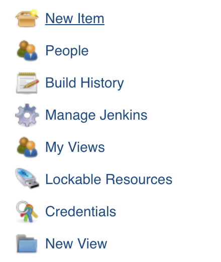

Then click:

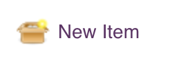

Next you will need to give the item a name. For the name, suffix
`-lab-creating-a-pipeline` with your pair name which should either be
your DockerHub ID or your GitHub username. I.e.
`pair-1-lab-creating-a-pipeline`:

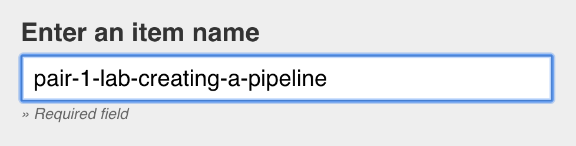

Then select the pipeline menu option:

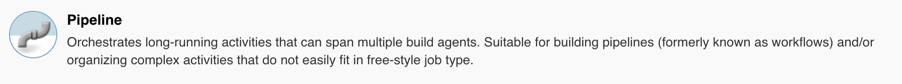

Click OK:

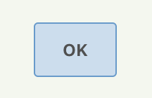

You will then be shown the pipeline configuration page. On this page,
under `Build Triggers`, select `Poll SCM`:

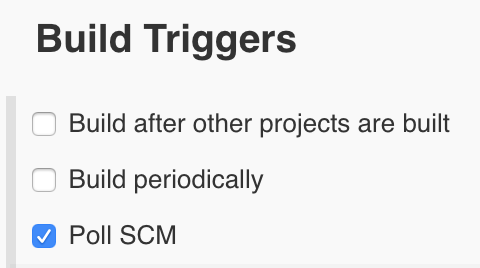

Below that, set the Schedule to be `* * * * *`, this will check every
minute for changes:


Move down to the section labelled `Pipeline`. Under `Definition`, select
`Pipeline script from SCM`:

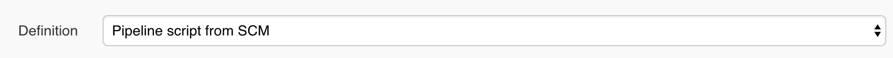

Under `SCM` select `Git`:

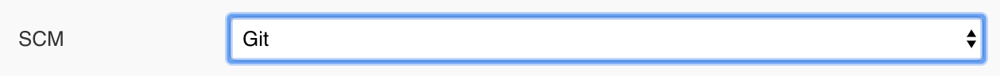

Under `Repositories` add the URL of your fork of
`lab-creating-a-pipeline` to `Repository URL`:

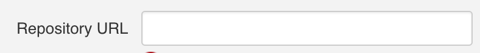

We are going to re-use the code from `lab-intro-to-kubernetes` so the
URL will be <https://github.com/GITHUB_ID/lab-intro-to-kubernetes.git>,
replacing `GITHUB_ID` with your GitHub user ID.

Once done the settings should look something like this:
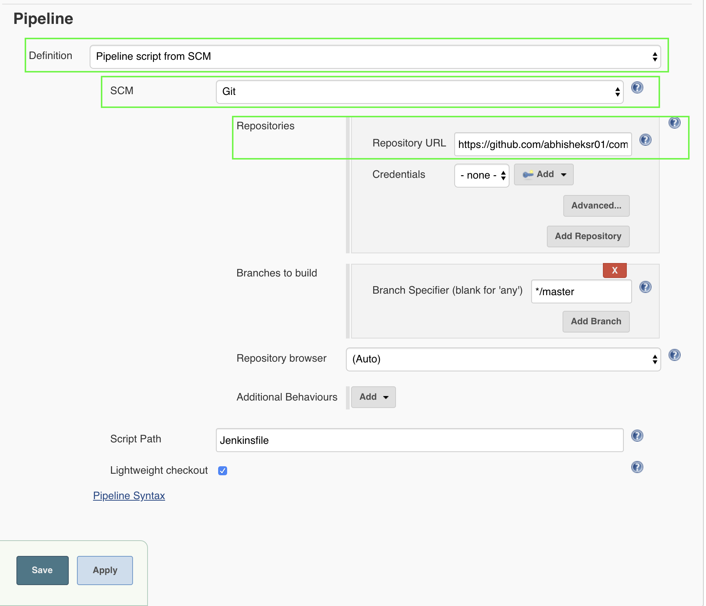

You can then click `Save`

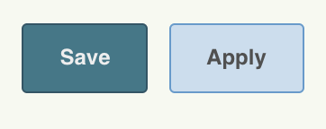

## Triggering a successful pipeline build

Once you save the pipeline, a build should be triggered automatically
within a minute. If you navigate to the Jenkins homepage and find your
project:


Then click on its name, you should get something similar to the
following:

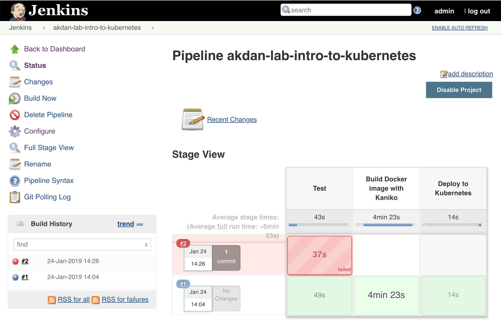

As you should be able to see, the build failed. This is for a number of
reasons so let's fix those one by one.

### Jenkinsfile

If you navigate into the `lab-intro-to-kubernetes` repository in your
editor, you will see a `Jenkinsfile` in the root. The configuration you
added earlier means that Jenkins will pick up this `Jenkinsfile`
automatically from the repo specified by repository URL. Let's edit this
file to make some corrections.

### User editable variables section

This is the only section of the `Jenkinsfile` you will need to edit for
this exercise. All other sections are for information and reference
only.

You will need to update the `github_id` variable with your own values.
Your GitHub ID will automatically become your namespace in Kubernetes
(which should already exist). This should be the account you used to
fork the repository.

``` groovy
// VARIABLES

def github_id = 'GITHUB_ID'
```

Once you have updated this variable, commit your file and push it to
GitHub.

``` bash
git add Jenkinsfile
git commit -m "Update github_id in Jenkinsfile"
git push
```

Jenkins should automatically poll the repo and you should see a build
start automatically. To see the activity of the build, find your item in
the list on the Jenkins homepage:


Click on the name of the item and you should be shown a page that looks
like this:

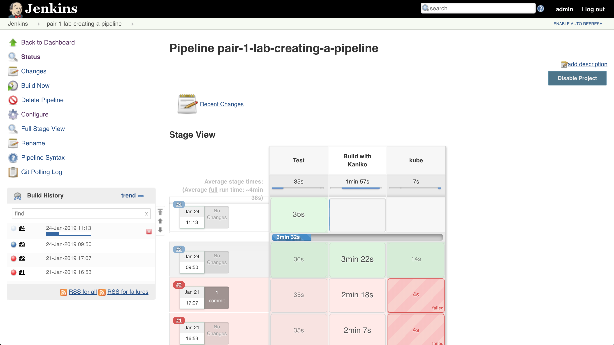

On that page, find the section that lists all of the recent builds:

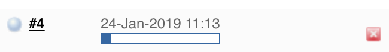

And then click on the build's progress bar:


This will take you to the build's console output.

Again, you should see that the build failed due to the tests failing
because of a change that we made earlier. The following line in
`lab-intro-to-kubernetes/app.py`:

``` python
return jsonify({"message": "Goodbye", "recipient": recipient})
```

To:

``` python
return jsonify({"message": "Hello", "recipient": recipient, "result": "OK"})
```

Again, commit your changes and push to GitHub

``` bash
git add app.py
git commit -m "Change message from Goodbye to Hello"
git push
```

This should make the tests pass and also automatically deploy your
changes to Kubernetes. If you navigate to the page you opened previously
in the browser, once the build completes, you should see your changes.

## `Jenkinsfile` explanations

### Other variables section

These variables are used by the pod template and build stages, but
shouldn't be edited.

``` groovy
// vvv DO NOT EDIT THE VARIABLES BETWEEN THESE MARKERS vvv //

def git_commit     = ''
def git_repository = 'https://github.com/${github_id}/lab-intro-to-kubernetes.git'
def image_name     = 'sepractices/${github_id}-lab-intro-to-kubernetes'
def kaniko_image   = 'gcr.io/kaniko-project/executor:debug-539ddefcae3fd6b411a95982a830d987f4214251'
def kubectl_image  = 'sepractices/jenkins-eks-kubectl-deployer:0.1.0'
def label          = "build-${UUID.randomUUID().toString()}"
def cluster_name   = 'prod-ak-k8s-cluster'
def namespace      = "${github_id}"
def pod_yaml       = """

kind: Pod
metadata:
  name: build-pod
spec:
  containers:
  - name: kaniko
    image: ${kaniko_image}
    imagePullPolicy: Always
    command:
    - /busybox/cat
    tty: true
    volumeMounts:
      - name: jenkins-docker-cfg
        mountPath: /root/.docker

  - name: kubectl
    image: ${kubectl_image}
    imagePullPolicy: Always
    tty: true

  - name: python-test
    image: python:3.7.7-slim-stretch
    tty: true

  volumes:
  - name: jenkins-docker-cfg
    projected:
      sources:
      - secret:
          name: regcred
          items:
            - key: dockerconfigjson
              path: config.json
"""

// ^^^ DO NOT EDIT THE VARIABLES BETWEEN THESE MARKERS ^^^ //
```

#### Variable descriptions

  - `git_commit`: variable created in this parent scope so that it can
    be set in the Docker image build stage and referenced by subsequent
    stages.
  - `git_repository`: name of the git repository to clone and work
    against.
  - `image_name`: image / Docker repository name that will be referenced
    when pushing to DockerHub or deploying to Kubernetes.
  - `kaniko_image`: Kaniko is a tool for building Docker images without
    a Docker daemon. This avoids having to use Docker in Docker. The
    image is a reference to the pre-built Kaniko image provided by
    Google.
  - `kubectl_image`: image reference for a container image that contains
    the necessary tooling to deploy to Kubernetes using `kubectl`.
  - `label`: a unique label for the executor node.
  - `namespace`: namespace to launch the application into.
  - `pod_yaml`: YAML configuration for describing the pods to be used by
    Kubernetes to run each build stage. The names of each container are
    referenced later in `container(name: CONTAINER_NAME){}` calls.

### Pod template and build stages section

Below you will see the configuration and descriptions for the pod
template and build stages.

``` groovy
// POD TEMPLATE AND BUILD STAGES

podTemplate(name: 'kaniko', label: label, yaml: pod_yaml) {
  node(label) {
    // PULL GIT REPOSITORY

    git git_repository

    // TEST STAGE

    stage('Test') {
      container(name: 'python-test', shell: '/bin/sh') {
        sh 'pip install pipenv'
        sh 'pipenv install --dev'
        sh 'pipenv run python -m pytest'
      }
    }

    // DOCKER IMAGE BUILD STAGE

    stage('Build Docker image with Kaniko') {
      git_commit = sh (
        script: 'git rev-parse HEAD',
        returnStdout: true
      ).trim()
      image_name += ":${git_commit}"
      echo "Building image ${image_name}"
      container(name: 'kaniko', shell: '/busybox/sh') {
        withEnv(['PATH+EXTRA=/busybox:/kaniko']) {
          sh """#!/busybox/sh
          /kaniko/executor -f `pwd`/Dockerfile -c `pwd` --skip-tls-verify --cache=true --destination=${image_name}
          """
        }
      }
    }

    // DEPLOY CODE TO KUBERNETES STAGE

    stage('Deploy to Kubernetes') {
      withCredentials([
        string(credentialsId: 'AWS_ACCESS_KEY_ID', variable: 'AWS_ACCESS_KEY_ID'),
        string(credentialsId: 'AWS_SECRET_ACCESS_KEY', variable: 'AWS_SECRET_ACCESS_KEY'),
        string(credentialsId: 'KUBERNETES_SERVER', variable: 'KUBERNETES_SERVER'),
        file(credentialsId: 'KUBERNETES_CA', variable: 'KUBERNETES_CA')
      ]) {
        container(name: 'kubectl', shell: '/bin/sh',) {
          sh '''
            kubectl config set-credentials aws --exec-arg=token --exec-arg=-i --exec-arg="${cluster_name}"
          '''
          sh '''
            kubectl config \
              set-cluster kubernetes \
              --server=$KUBERNETES_SERVER \
              --certificate-authority=$KUBERNETES_CA
          '''
          sh "yq w -i kubernetes/deployment.yml 'spec.template.spec.containers[0].image' ${image_name}"
          sh "kubectl create namespace ${namespace} || true"
          sh "kubectl apply -n ${namespace} -f kubernetes/"
        }
      }
    }
  }
}
```

#### podTemplate

The `podTemplate` definition is used by Jenkins and Kubernetes to
orchestrate containers for the build.

#### node

A `node` represents an executor agent where the build will take place.
This is required for any pipeline to do any work. This will utilise the
`podTemplate` created before it.

#### git

The `git` function pulls down the required git repository.

#### stage

Each build stage is described using a `stage` function. Each one
contains a set of instructions that are required to complete a build.
The `Jenkinsfile`

## Other Jenkins menu items

If you click on the number or the date and time of the build from:


You will be taken to the build detail page:

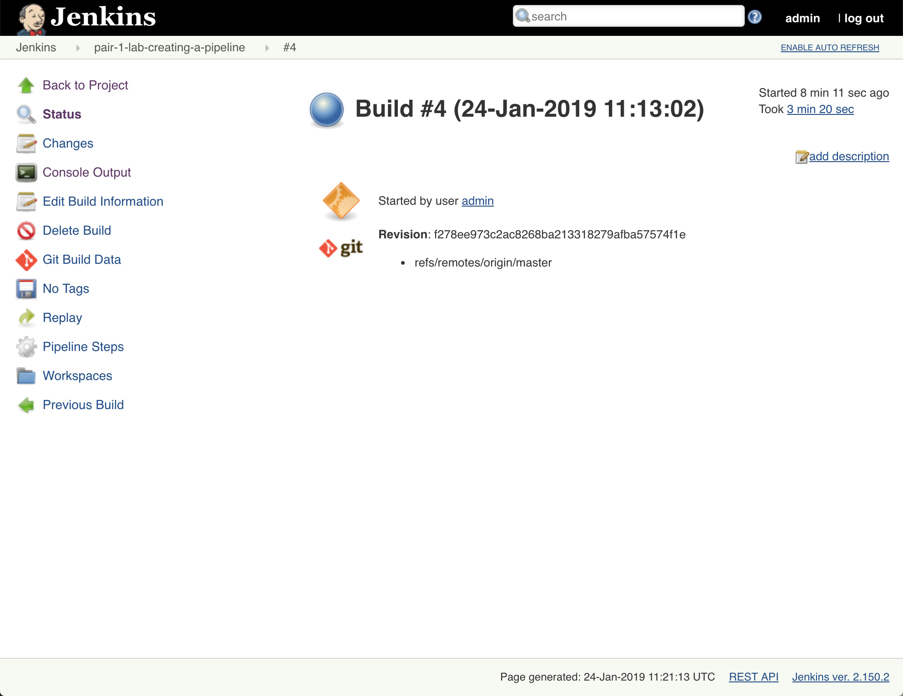

From here you can get to the same output by clicking on the Console
Output button:


You can also update the build configuration by clicking the Configure
button:

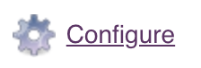

At any point, you can get back to the projects home page by clicking on
the breadcrumb at the top of the page:

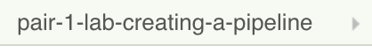

At any point where you see this icon next to your project or on a
project page, you can also run the build without having to push to the
repository:


