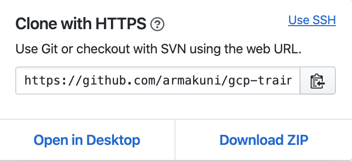
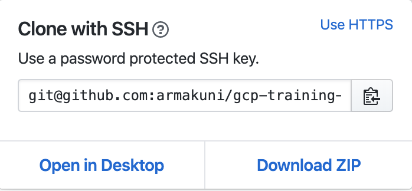

# Git

This is a basic guide to help with some essential concepts and commands
required for using Git during the training.f

All of the commands should be run from GitBash.

When cloning, you should always use a SSH URL. These look something like
the following:

    git@github.com:software-engineering-practices/exercises.git

Conversely, if you are using the URL in a context where you don't need
or are unable to push, then you will want to use a HTTPS URL like so:

    https://github.com/software-engineering-practices/exercises.git

From the repository's GitHub page, you will see a button like the one
below:

From here you can select either a HTTPS clone dialog / URL:

Or a SSH clone dialog or URL:

These can be toggled using the links in the top right of the dialogs.
